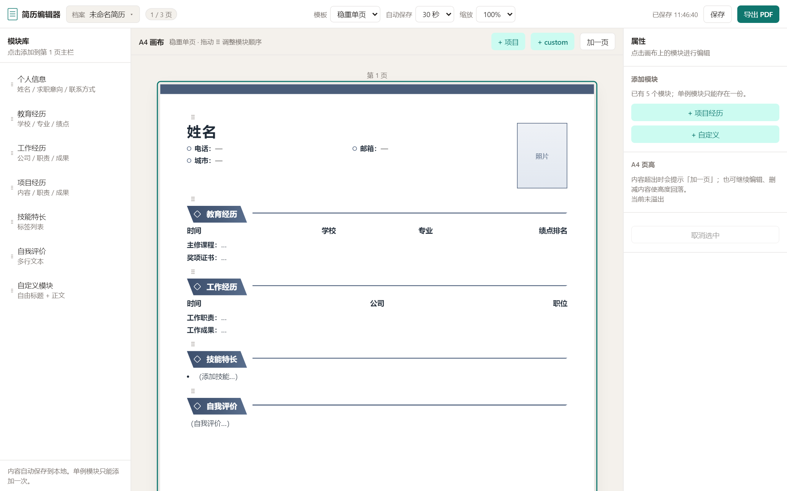
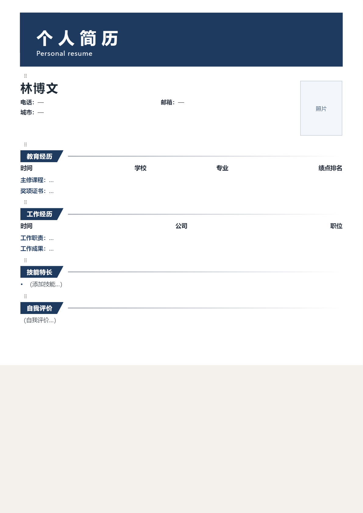
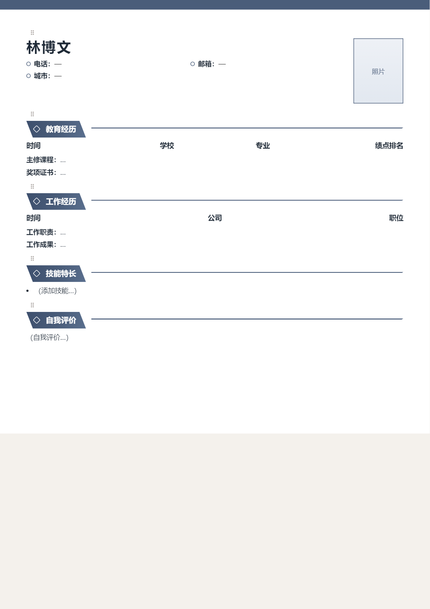
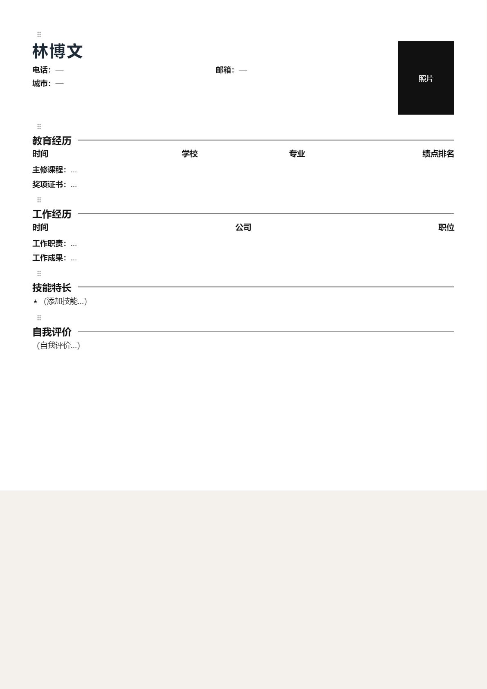

# ResumeApp

[English](./README.md) | [简体中文](./README.zh-CN.md)

> A local-first resume builder with drag-and-drop modules, Chinese-style templates, and A4 print-ready export.

### Preview

| Editor workbench | Clean Navy |
|:----------------:|:----------:|
|  |  |
| **Steady Classic** | **Minimal Black** |
|  |  |

---

## Features

- **Multiple resume archives** — create, rename, duplicate, switch; stored in your browser
- **Drag-and-drop layout** — reorder modules with ⠿; move across pages
- **Section editing** — basic info, education, work, projects, skills, summary, custom
- **Content blocks** — bold labels (e.g. Work duties / Project results), add/remove freely
- **Photo upload & crop** — zoom/pan, local storage
- **Date pickers** — year–month, up to **+2 years** in the future
- **Three templates** — Steady Classic / Clean Navy / Minimal Black
- **A4 overflow** — clipped on canvas + non-blocking “Add page?” (max 3 pages)
- **Autosave** — 15s / 30s / 60s / off; restore after refresh
- **Print / PDF** — browser print → Save as PDF

---

## Quick start

```bash
npm install
npm run dev
```

Open http://localhost:5173/

On Windows you can double-click `start-dev.bat`.

```bash
npm run build   # output in dist/
```

### Desktop app (Electron)

```bash
# Run as a native window (loads dist)
npm run electron:start

# Installer / portable build → release/
npm run electron:build
```

Or double-click `start-desktop.bat` on Windows.

---

## How to use

1. Add modules from the left palette or toolbar
2. Click a block on the canvas → edit on the right; drag ⠿ to reorder
3. Upload and crop a headshot under Basic Info
4. Switch template / archive / autosave interval in the top bar
5. **Export PDF** → choose “Save as PDF” in the system print dialog

---

## Stack

| Layer | Tech |
|-------|------|
| App | React 18 + TypeScript + Vite |
| State | Zustand |
| Storage | IndexedDB (`idb`) |
| DnD | @dnd-kit |
| UI | CSS Modules + design tokens |

---

## Layout

```
src/
  domain/       # types, layout math, A4 measure
  storage/      # IndexedDB repositories
  stores/       # archive / settings (Zustand)
  modules/      # section forms + canvas previews
  features/     # canvas, palette, cropper, autosave…
  styles/       # tokens, print, templates
docs/
  screenshots/  # README images
  框架设计.md
  工程设计.md
```

---

## A4 rules

| Item | Value |
|------|-------|
| Screen | 794 × 1122 px |
| Print | 210 × 297 mm |
| Max pages | 3 |
| Overflow | Clip on canvas + “Add page?” prompt (editing stays on) |

---

## License

This project is licensed under the **[PolyForm Noncommercial License 1.0.0](./LICENSE)**.

- **Allowed:** personal / educational / non-profit use and private modifications
- **Not allowed:** any commercial use (including SaaS, embedding in paid products, resale)

See the full terms in [`LICENSE`](./LICENSE).

Required Notice: Copyright Mosking (https://github.com/mosking128/ResumeApp)
