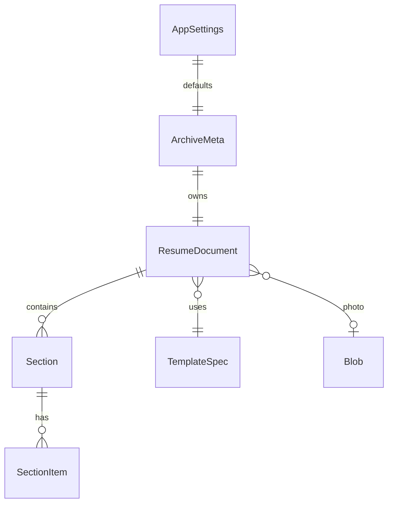
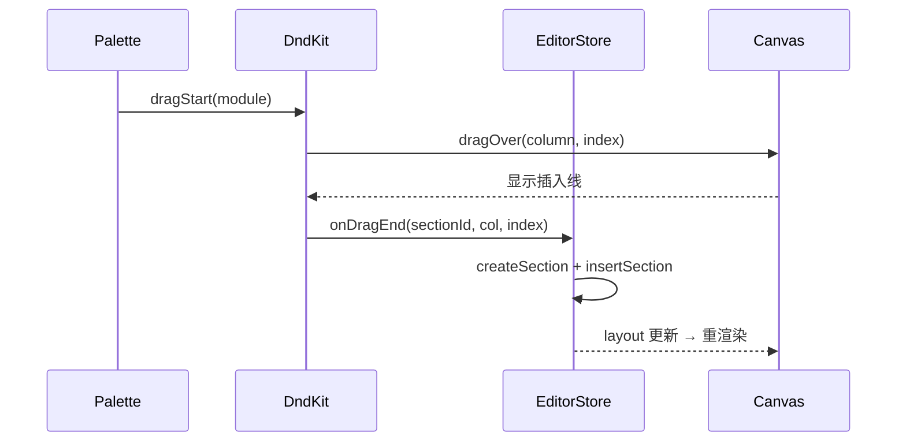

# 简历编辑器 — 框架设计

> 版本：v0.2（含 A4 多页与溢出闸门）  
> 状态：待评审  
> 范围：架构分层、领域模型、模块边界、模板、分页与持久化方案  
> 配套文档：[工程设计.md](./工程设计.md)

---

## 1. 产品边界

### 1.1 一句话定位

一款**纯前端、本地优先**的简历编辑工作台：用拖拽模块灵活排版，支持多档案存档与多风格模板，自动保存到浏览器本地。

### 1.2 核心用户故事

| # | 角色 | 故事 | 验收要点 |
|---|---|---|---|
| U1 | 求职者 | 我想新建/管理多份简历档案，针对不同岗位分开投递 | 可创建、重命名、复制、删除、切换档案 |
| U2 | 求职者 | 我想用拖拽把模块排成适合我的版式 | 模块可插入、同列排序、跨列移动、移除 |
| U3 | 求职者 | 我想一键切换不同风格模板 | 内容不丢，版式/配色/栏数按模板变化 |
| U4 | 求职者 | 我想上传证件照并裁剪 | 支持本地选图、缩放平移、常用比例、替换/删除 |
| U5 | 求职者 | 我想方便地填写教育/工作/项目时间段 | 年-月选择 +「至今」开关，起止校验 |
| U6 | 求职者 | 我不想每次手动保存 | 可配置间隔自动保存，并有保存状态反馈 |
| U7 | 求职者 | 内容写满一页时我要有明确边界 | 超出 A4 内容区即提醒「是否加页」；不加页则阻止继续写入 |

### 1.3 A4 分页策略（硬约束）

简历以 **A4 纸面** 为唯一输出介质，编辑器必须做**页高判定**：

1. 每页内容区高度固定（A4 减去模板内边距）。
2. 任意编辑导致某页内容高度 **超出** 时，立即弹出确认：
   - **加一页**：在该页之后追加空白页，溢出内容可迁入新页，并解除写入锁定。
   - **取消**：不加页；**锁定**该页（及触发溢出的模块）继续写入，直到用户删短内容或改为加页。
3. 达到最大页数（默认 **3 页**）后「加一页」禁用，只能删内容。
4. 不允许「无限长单页」——打印/PDF 必须与屏幕页结构一致。

### 1.4 明确非目标（V1）

- 云同步、账号体系、多人协作
- 服务端存储与 API
- ATS 关键词解析、AI 代写
- LaTeX / Word 导出
- 任意像素级自由画布（非模块化海报编辑器）
- 移动端原生 App（V1 以桌面浏览器为主，小屏可降级为只读预览）

---

## 2. 技术栈定稿

| 层 | 选型 | 说明 |
|---|---|---|
| 构建 | **Vite 6** | 根目录 `index.html` 入口，秒级 HMR |
| 框架 | **React 18 + TypeScript (strict)** | 组件生态成熟，适合复杂表单+画布 |
| 状态 | **Zustand** | 轻量；拆成 archives / editor / settings 三 store |
| 拖拽 | **@dnd-kit/core + sortable** | 无障碍友好、排序/跨容器成熟 |
| 持久化 | **IndexedDB（idb）** | 多档案、结构化文档、照片 Blob |
| 样式 | **CSS Modules + CSS 变量 Token** | 模板主题可切换，不绑 UI 框架 |
| 照片裁剪 | Canvas 自研轻量裁剪（或 `react-easy-crop`） | 1:1 / 3:4，导出压缩图 |
| 日期 | 自研「年-月」选择器 | 简历场景不需要精确到日 |
| 页高测量 | DOM `ResizeObserver` + 预估表 | 实时判定是否超出 A4 内容区 |
| 导出 | 打印 CSS + 浏览器「另存为 PDF」 | 按 `pages[]` 分页打印 |

**选型原则**：少依赖、可离线、数据在本地、模块可扩展。

---

## 3. 分层架构

```
┌─────────────────────────────────────────────────────────┐
│  UI Shell（顶栏 · 左模块库 · 中画布 · 右属性面板）          │
├─────────────────────────────────────────────────────────┤
│  Feature Hooks（useEditor / useArchive / useAutosave…）  │
├─────────────────────────────────────────────────────────┤
│  Zustand Stores（内存态 · 单向数据流）                     │
├─────────────────────────────────────────────────────────┤
│  Domain（类型 · 校验 · 迁移 · id · 纯函数）                │
├─────────────────────────────────────────────────────────┤
│  Storage Repositories（IndexedDB 读写）                  │
└─────────────────────────────────────────────────────────┘
```

### 3.1 职责划分

| 层 | 负责 | 不负责 |
|---|---|---|
| UI | 渲染、交互事件、局部表单态 | 业务规则、持久化细节 |
| Feature Hooks | 把 store/API 组合成「一次用户意图」 | 直接操作 DOM / IndexedDB |
| Stores | 当前编辑态、选中态、脏标记 | 数据库 schema、文件 IO |
| Domain | 类型、校验、layout 纯函数、schema 迁移 | React、异步 IO |
| Storage | 读写 archives/documents/blobs/settings | UI 文案、组件树 |

### 3.2 依赖方向

**只允许向下依赖**：`UI → Hooks → Stores → Domain ← Storage`  
Domain 不依赖 React；Storage 不依赖 Store；模板渲染读取 Domain 数据，不反向写 Store。

---

## 4. 领域模型

### 4.1 实体关系



### 4.2 核心类型

```ts
/** 年-月；简历不使用「日」 */
export type MonthYear = { year: number; month: number }; // month: 1–12

export type DateRange = {
  start: MonthYear | null;
  end: MonthYear | null;
  /** 结束时间「至今」 */
  isPresent?: boolean;
};

export type SectionType =
  | 'basic'        // 个人信息（含照片、联系方式）
  | 'objective'    // 求职意向
  | 'summary'      // 自我评价
  | 'education'
  | 'work'
  | 'project'
  | 'skills'
  | 'custom';      // 自定义文本块

export interface SectionItemBase {
  id: string;
}

export interface EducationItem extends SectionItemBase {
  school: string;
  major: string;
  degree: string;       // 本科/硕士/…
  date: DateRange;
  description: string;
}

export interface WorkItem extends SectionItemBase {
  company: string;
  title: string;
  date: DateRange;
  highlights: string[]; // 要点列表
}

export interface ProjectItem extends SectionItemBase {
  name: string;
  role: string;
  date: DateRange;
  link?: string;
  highlights: string[];
}

export interface SkillItem extends SectionItemBase {
  name: string;
  level?: string;       // 熟悉/熟练/精通（可选）
}

export interface CustomItem extends SectionItemBase {
  title: string;
  body: string;
}

export interface BasicInfo {
  name: string;
  phone: string;
  email: string;
  location?: string;
  website?: string;
  extras?: { label: string; value: string }[];
}

export type SectionPayloadMap = {
  basic: BasicInfo;
  objective: { text: string };
  summary: { text: string };
  education: EducationItem[];
  work: WorkItem[];
  project: ProjectItem[];
  skills: SkillItem[];
  custom: CustomItem[];
};

export interface Section<T extends SectionType = SectionType> {
  id: string;
  type: T;
  /** 用户可改的展示标题，如「工作经历」→「实习经历」 */
  title: string;
  /** basic/objective/summary 为单对象，其余为数组 */
  payload: SectionPayloadMap[T];
}

export interface LayoutColumn {
  id: string;
  /** 列宽比例，各列之和 ≈ 1 */
  widthRatio: number;
  sectionIds: string[];
}

/** 一张 A4 纸面；多页简历 = pages[] 顺序排列 */
export interface ResumePage {
  id: string;
  columns: LayoutColumn[];
}

/** A4 物理尺寸（CSS px，96dpi） */
export const A4 = {
  width: 794,
  height: 1123,
} as const;

export interface ResumeDocument {
  id: string;
  archiveId: string;
  schemaVersion: number;
  templateId: string;
  photoBlobId?: string;
  photoMeta?: {
    zoom: number;
    crop: { x: number; y: number };
    aspect: 1 | 0.75; // 1:1 | 3:4
  };
  sections: Section[];
  /**
   * ≥1 页；V1 默认 1 页，溢出确认后追加。
   * 旧字段 `layout` 在迁移中并入 pages[0].columns 后删除。
   */
  pages: ResumePage[];
  createdAt: number;
  updatedAt: number;
}

/** 页高检测运行时状态（不入库，由 editorStore 维护） */
export interface PageOverflowState {
  /** 有内容溢出的 pageId */
  overflowingPageId: string | null;
  /** 溢出像素（内容高 - 内容区高） */
  overflowPx: number;
  /** true 时阻止继续写入 */
  inputLocked: boolean;
  /** 待确认加页 */
  pendingAddPageAfterId: string | null;
}

export interface ArchiveMeta {
  id: string;
  name: string;
  documentId: string;
  templateId: string;
  updatedAt: number;
}

export interface AppSettings {
  /** null = 关闭自动保存 */
  autosaveIntervalMs: number | null;
  defaultTemplateId: string;
}

export interface TemplateSpec {
  id: string;
  name: string;
  description: string;
  /** 单栏 or 侧栏双栏等布局预设 */
  layoutMode: 'single' | 'sidebar' | 'two-column';
  /** 主题 token，注入画布 CSS 变量 */
  tokens: {
    bg: string;
    ink: string;
    muted: string;
    accent: string;
    rule: string;
    headingFont: string;
    bodyFont: string;
    scale: number; // 全局字号缩放
  };
  /** 默认新建文档时的列配置 */
  defaultLayout: Omit<LayoutColumn, 'sectionIds'> & {
    defaultSectionOrder: SectionType[];
  };
  /** 页内边距，决定 A4 内容区高度 */
  contentBox: {
    paddingTop: number;
    paddingBottom: number;
    paddingLeft: number;
    paddingRight: number;
  };
}
```

### 4.3 标识与版本

- 实体 id：`crypto.randomUUID()`
- 文档 `schemaVersion`：整数递增；Storage 层加载时跑迁移表
- 当前版本：`SCHEMA_VERSION = 2`（v1 若曾有单页 `layout` 字段，并入 `pages[0]`）
- 常量：`MAX_PAGES = 3`，`A4 = { width: 794, height: 1123 }`

---

## 5. 模块注册表（Module Registry）

拖拽内核**不感知**具体简历字段；各 section 通过注册表接入。

```ts
export interface ModuleDefinition<T extends SectionType> {
  type: T;
  /** 模块库展示名 */
  label: string;
  /** 默认区块标题 */
  defaultTitle: string;
  icon?: React.ComponentType;
  /** 该模块是否为单例（如 basic） */
  singleton?: boolean;
  /** 创建空 payload */
  createEmpty: () => SectionPayloadMap[T];
  /** 画布渲染（只读预览） */
  Renderer: React.FC<{ section: Section<T>; doc: ResumeDocument }>;
  /** 右侧属性面板编辑器 */
  Editor: React.FC<{
    section: Section<T>;
    onChange: (patch: Partial<Section<T>>) => void;
  }>;
  /** 画布上是否显示标题栏 */
  showTitle: boolean;
}

export const moduleRegistry: Record<SectionType, ModuleDefinition<any>>;
```

**扩展方式**：新增一种经历类型 = 新增目录 `src/modules/xxx/` + 注册一条 definition，布局/拖拽/存储零改动。

### 5.1 内置模块一览

| type | 单例 | 默认标题 | 要点 |
|---|---|---|---|
| basic | ✓ | 个人信息 | 姓名/电话/邮箱/城市/照片 |
| objective | ✓ | 求职意向 | 单段文本或标签行 |
| summary | | 自我评价 | 多行文本 |
| education | | 教育经历 | 多条 + 年月区间 |
| work | | 工作经历 | 多条 + 要点列表 |
| project | | 项目经历 | 多条 + 链接 + 要点 |
| skills | | 技能特长 | 标签式列表 |
| custom | | 自定义 | 自由标题 + 正文 |

---

## 6. 拖拽与布局模型

### 6.1 画布结构（多页）

```
Canvas
├── Page 1 (A4 794×1123)
│   ├── Column A (widthRatio: 0.68)
│   │   ├── Section: basic
│   │   ├── Section: work
│   │   └── Section: project
│   └── Column B (widthRatio: 0.32)
│       ├── Section: skills
│       └── Section: education
└── Page 2 (仅在加页后出现)
    └── …
```

- **single** 模板：每页仅 1 列
- **sidebar / two-column**：每页 2 列
- 画布纵向滚动浏览多页；页与页之间有间距与页码标签（第 1 页 / 第 2 页）

### 6.2 操作原语（Domain 纯函数）

操作对象统一为「某一页的 layout」：

```ts
insertSection(pages, pageIndex, sectionId, columnId, index): ResumePage[]
moveSection(pages, sectionId, toPageId, toColumnId, toIndex): ResumePage[]
removeSection(pages, sectionId): ResumePage[]
addPageAfter(pages, pageId, templateDefaultColumns): ResumePage[]
removePage(pages, pageId): ResumePage[]  // 页内 section 一并移出/删除（见下）
collapseToSingleColumn(columns): LayoutColumn[]
```

约束：
- **section 全局唯一**：一个 section 同时只出现在一页的一列中
- `removePage`：若页内仍有 section，默认弹确认「连同内容删除」或「移到上一页」（V1 可先「连同内容删除」+ confirm）
- 页数上限：`MAX_PAGES = 3`

UI 只调用这些函数，保证可单测、可撤销（后续扩展）。

### 6.3 拖拽来源

| 来源 | 目标 | 行为 |
|---|---|---|
| 左侧模块库 | 某页某列某 index | `createSection` + `insertSection` |
| 画布 section | 同页同列其他 index | `moveSection` |
| 画布 section | 同页另一列 | `moveSection` |
| 画布 section | **另一页**某列 | `moveSection`（跨页） |
| 画布 section | 「移除区」/按钮 | `removeSection` |

**拖拽把手**：仅标题栏左侧 grip 可拖，避免与输入框焦点冲突。  
**键盘替代**：属性面板提供「上移 / 下移 / 移到左栏 / 移到右栏 / 移除」。  
**写入锁定时**：仍允许拖拽与删除（用来减内容），但文本输入框 `readOnly`。

### 6.4 放置指示

- 悬停列：显示目标 index 的 2px 插入线（accent 色）
- 非法放置（单例重复插入 basic）：禁止 drop + 模块库禁用态
- 悬停空白页：整页淡入 accent 虚线边框

### 6.5 A4 页高判定与加页闸门

#### 测量模型

```
pageContentHeight = A4.height - templatePaddingY
columnContentHeight(sectionId) = 实测 DOM 高度（含 gap）
pageUsedHeight = max(各列 sum(sectionHeights + gaps))
```

- 模板声明 `contentBox: { paddingTop, paddingBottom }`（左右同理，V1 重点是高度）
- 每个 section 根节点挂 `data-section-id`，用 `ResizeObserver` 采集高度
- 编辑防抖 **120ms** 后重算；仅当 `pageUsedHeight > pageContentHeight + 1` 视为溢出

#### 状态机

```
  editing
     │ content grows
     ▼
  measuring ──ok──► editing
     │ overflow
     ▼
  overflow-modal  ──「加一页」──► addPage → unlock → editing
     │
     └──「取消」──► input-locked ──删短内容后不再溢出──► editing
                        │
                        └── 再次溢出/保持溢出 → 保持 locked
```

#### 闸门规则（写入阻断）

| 场景 | 行为 |
|---|---|
| 检测到溢出 | 立即打开模态框「内容已超出第 N 页，是否加一页？」 |
| 用户选「加一页」 | `addPageAfter`；焦点保持在原输入；`inputLocked=false` |
| 用户选「取消」 | 关闭模态；`inputLocked=true`；溢出页红/琥珀色警示条 |
| locked 时继续键入 | 文本控件 `readOnly` / `onKeyDown` 拦截，不再增大内容 |
| locked 时删除字符 | 允许；高度回落到页内后自动解锁 |
| locked 时拖入新模块 | 禁止（palette 对目标页禁用） |
| 页数已达 `MAX_PAGES` | 模态中「加一页」禁用，文案说明已达上限 |

#### 模态文案（中文）

- 标题：`内容超出第 N 页`
- 说明：`是否新增一页继续编辑？不加页则无法继续写入，可先删减内容。`
- 按钮：`加一页`（主） / `取消`（次）
- 达上限：`已达到最大 3 页，请删减内容后再编辑。`

#### 与自动保存关系

- 溢出未处理时：文档仍可保存（含溢出内容），但 UI 持续警示
- 加页成功：`dirty=true`，走正常 autosave

---

## 7. 模板系统

### 7.1 原则

**模板 = 布局预设 + 主题 Token + 渲染微调**，不是多套互不兼容的 DOM 树。

- 文档数据与模板解耦：换 `templateId` 不改 `sections[]`
- 换模板时：若目标为 single 且当前多列 → 所有 section 按原阅读序合并进单列
- 换模板时：若目标为双栏 → 用模板 `defaultLayout` 的 section 类型建议重新分列（basic/summary 可进侧栏），用户已拖好的顺序优先保留

### 7.2 V1 内置模板

| id | 名称 | 布局 | 气质 |
|---|---|---|---|
| `classic-single` | 经典单栏 | 单栏 | 衬线标题、规整分隔线，传统稳妥 |
| `modern-sidebar` | 现代侧栏 | 双栏 0.68/0.32 | 左侧信息栏深色块，主栏内容区 |
| `compact-grid` | 紧凑双栏 | 双栏 0.55/0.45 | 高密度、细线、适合内容多的简历 |

### 7.3 Token 注入

画布根节点：

```html
<div class="resume-page" data-template="modern-sidebar" style="
  --r-bg: …; --r-ink: …; --r-accent: …;
  --r-heading-font: …; --r-body-font: …; --r-scale: …;
">
```

各 `Renderer` 只使用这些变量，不硬编码颜色。

---

## 8. 持久化与自动保存

### 8.1 IndexedDB 结构

数据库名：`resume-app`  
版本：跟随 `schemaVersion` 策略（DB version 与文档 schema 分开管理）

| Store | Key | Value |
|---|---|---|
| `archives` | `id` | `ArchiveMeta` |
| `documents` | `id` | `ResumeDocument` |
| `blobs` | `id` | `{ id, mime, bytes: Blob }` |
| `settings` | `'app'` | `AppSettings` |

索引：`archives.by-updatedAt`、`documents.by-archiveId`（便于列表排序与清理）。

### 8.2 Repository 接口

```ts
interface ArchiveRepository {
  list(): Promise<ArchiveMeta[]>;
  get(id: string): Promise<ArchiveMeta | null>;
  create(name: string, templateId: string): Promise<{ meta: ArchiveMeta; doc: ResumeDocument }>;
  rename(id: string, name: string): Promise<void>;
  duplicate(id: string): Promise<ArchiveMeta>;
  remove(id: string): Promise<void>; // 级联删 document + 引用 blob
}

interface DocumentRepository {
  get(id: string): Promise<ResumeDocument | null>;
  save(doc: ResumeDocument): Promise<void>;
}

interface BlobRepository {
  put(bytes: Blob, mime: string): Promise<string>;
  get(id: string): Promise<Blob | null>;
  remove(id: string): Promise<void>;
}

interface SettingsRepository {
  get(): Promise<AppSettings>;
  save(s: AppSettings): Promise<void>;
}
```

### 8.3 自动保存状态机

```
        edit
         │
         ▼
   ┌──────────┐  schedule(ms)   ┌──────────┐
   │  dirty   │ ──────────────► │ scheduled│
   └──────────┘                 └────┬─────┘
        ▲                            │ timer / flush
        │ edit                       ▼
        │                      ┌──────────┐
        └──────────────────────│  saving  │
                               └────┬─────┘
                         ok         │        fail
                          ▼         │         ▼
                    ┌──────────┐    │   ┌──────────┐
                    │   idle   │◄───┘   │  error   │──retry──► saving
                    └──────────┘        └──────────┘
```

规则：
1. `autosaveIntervalMs === null` → 不自动写，仅手动「保存」
2. 默认间隔 **30s**；可选 15s / 30s / 60s / 关闭
3. 编辑后重置计时器（防抖语义：最后一次编辑起算）
4. 切换档案、关闭标签页（`visibilitychange` / `beforeunload`）→ 强制 `flush()`
5. 失败：顶栏显示「保存失败」+ 重试按钮；不丢内存态

### 8.4 Schema 迁移

```ts
const migrations: Record<number, (doc: any) => any> = {
  // 1: (doc) => ({ ...doc, schemaVersion: 2, /* … */ }),
};

function migrateDocument(raw: any): ResumeDocument {
  let doc = raw;
  while (doc.schemaVersion < SCHEMA_VERSION) {
    const fn = migrations[doc.schemaVersion];
    if (!fn) throw new Error(`No migration from ${doc.schemaVersion}`);
    doc = fn(doc);
  }
  return doc;
}
```

---

## 9. 照片子系统

```
用户选 File
  → 校验 type/size（≤ 5MB，image/*）
  → createObjectURL 预览
  → 裁剪 UI（缩放、平移、比例 1:1 | 3:4）
  → canvas 绘制 + toBlob(jpeg, 0.85)
  → 最长边压至 ≤ 1024px
  → BlobRepository.put → photoBlobId
  → document.photoMeta 保存 zoom/crop 以便再次编辑
```

basic 模块 Renderer 用 `URL.createObjectURL(blob)` 或 IDB 读出的 blob URL 渲染；组件卸载时 `revokeObjectURL`。

---

## 10. 时间选择器

- 数据：`MonthYear | null` + `isPresent`
- UI：年份下拉（当前年 ± 下拉列表）+ 12 月网格；结束时间提供「至今」
- 校验（Domain）：`compareMonthYear(start, end) ≤ 0`；`isPresent` 时忽略 end 月年
- 展示：`2022.03 – 2024.06` / `2022.03 – 至今`

---

## 11. 关键时序

### 11.1 启动与打开档案

```mermaid
sequenceDiagram
  participant App
  participant ArchiveStore
  participant Repo
  participant EditorStore
  participant IndexedDB

  App->>ArchiveStore: hydrate()
  ArchiveStore->>Repo.list()
  Repo->>IndexedDB: archives.getAll
  IndexedDB-->>Repo: ArchiveMeta[]
  Repo-->>ArchiveStore: list
  ArchiveStore->>ArchiveStore: setCurrent(last or first)
  ArchiveStore->>EditorStore: open(documentId)
  EditorStore->>Repo.get(documentId)
  Repo->>IndexedDB: documents.get + migrate
  IndexedDB-->>EditorStore: ResumeDocument
  EditorStore-->>App: 渲染工作台
```

### 11.2 编辑 → 自动保存

```mermaid
sequenceDiagram
  participant User
  participant EditorStore
  participant Autosave
  participant Repo
  participant IndexedDB

  User->>EditorStore: patchSection(...)
  EditorStore->>EditorStore: markDirty()
  EditorStore->>Autosave: notifyChange()
  Autosave->>Autosave: debounce(autosaveIntervalMs)
  Autosave->>EditorStore: getSnapshot()
  EditorStore-->>Autosave: ResumeDocument
  Autosave->>Repo.save(doc)
  Repo->>IndexedDB: put(documents)
  IndexedDB-->>Repo: ok
  Repo-->>Autosave: ok
  Autosave-->>User: 状态「已保存 · HH:mm」
```

### 11.3 拖入模块



---

## 12. 应用信息架构（工作台）

```
┌──────────────────────────────────────────────────────────────┐
│ 顶栏: Logo | 档案下拉 | 模板选择 | 页数 | 保存状态 | 保存 | 打印 │
├────────────┬─────────────────────────────────┬───────────────┤
│ 模块库      │  多页 A4 画布（可缩放）           │ 属性面板       │
│            │  [第 1 页]  794×1123             │               │
│ [个人信息]  │  ┌─────────────────────────┐    │ 字段编辑      │
│ [教育经历]  │  │  选中模块的表单          │    │ 列表增删      │
│ [工作经历]  │  └─────────────────────────┘    │ 布局操作      │
│ …          │  [第 2 页]（若存在）              │ 溢出时显示    │
│ 拖到画布 →  │                                 │ 「加一页」快捷 │
├────────────┴─────────────────────────────────┴───────────────┤
│ 缩放 · 溢出警示条（可点「加一页」）· Toast                     │
└──────────────────────────────────────────────────────────────┘
```

- 左栏宽约 **240px**，右栏约 **300px**，中间自适应
- 画布每页固定 A4（794×1123），支持缩放 75%–125%
- 顶栏显示 `共 N 页`；溢出页标签角标琥珀色
- 选中态：画布 section 描边 accent；右栏切换对应 Editor

---

## 13. 风险与对策

| 风险 | 影响 | 对策 |
|---|---|---|
| IndexedDB 配额不足 | 无法保存照片 | 压缩图片；配额错误明确提示 |
| 拖拽与输入焦点冲突 | 表单难用 | 仅 grip 可拖 + 键盘替代操作 |
| 中文打印字体差异 | PDF 版式漂移 | 打印样式使用常见字体栈；文档说明用系统打印 |
| 多档案切换丢编辑 | 数据丢失 | 切换前 `flush()`；失败则阻止切换 |
| 模板切换重排混乱 | 用户困惑 | 保留阅读序；单栏合并有预览确认（V1 可直接合并 + toast） |
| 大文档频繁全量写 | 卡顿 | 防抖整文档写（V1 足够）；后续可 patch |
| **页高测量不准**（字体/行高差异） | 误报或漏报溢出 | 以 **实测 DOM** 为准；打印前后自检；保留 1–2px 容差 |
| **加页后阅读序断裂** | 简历看起来被硬切 | 加页时提示用户拖模块到新页；后续可做「自动流式分页」 |
| **写入锁定过严** | 用户觉得卡死 | 模态文案明确；允许删除；底栏常驻「加一页」 |

---

## 14. 架构决策记录（ADR 摘要）

| ID | 决策 | 备选 | 代价 |
|---|---|---|---|
| ADR-01 | 纯前端 + IndexedDB | 后端+云同步 | 无跨设备 |
| ADR-02 | React + Zustand | Vue3 / 原生 | 包体稍大 |
| ADR-03 | dnd-kit | rbd（停维护）/ HTML5 DnD | 学习成本 |
| ADR-04 | CSS Modules + Token | Tailwind / CSS-in-JS | 手写样式多 |
| ADR-05 | 模块级拖拽 | 字段级自由摆放 | 自由度略低，稳定性高 |
| ADR-06 | 模板=主题+布局预设 | 多套硬编码页 | 不能任意 HTML 模板 |
| ADR-07 | 打印 CSS 出 PDF | jsPDF/html2pdf | 版式控制较弱 |
| ADR-08 | 年-月选择器 | 完整日期选择器 | 不支持「日」精度 |
| ADR-09 | **多页 A4 + 溢出闸门**（确认加页，否则锁写入） | 无限长单页 / 自动流式分页 | 需用户决策；自动流式更好用但实现更重，留 V2 |

---

## 15. 下一步

1. 评审本文档与《工程设计.md》
2. 按工程设计里程碑 **M0 → M6** 增量实现
3. 每里程碑结束后对照验收清单（见工程设计 §10）
